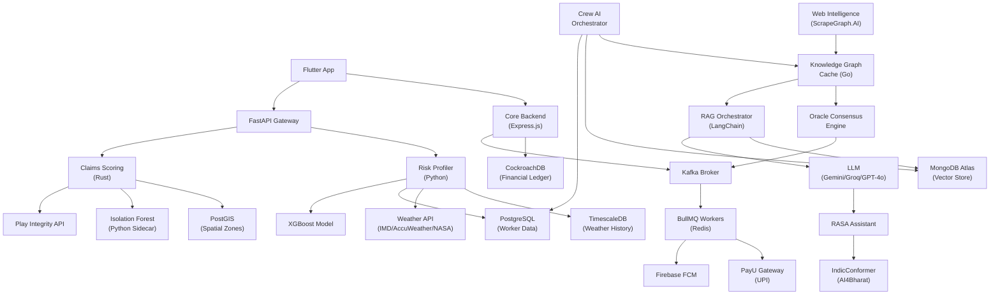

# Design Document: Continuum ML Pipelines

## Overview

Continuum is a parametric income protection platform for gig delivery workers (Swiggy/Zomato partners). The system automatically triggers payouts when verified weather or platform disruption events prevent workers from earning. This design covers the full backend and ML pipeline that replaces the Flutter app's mock data layer.

The platform is built around three core guarantees:
- **Actuarial fairness**: weekly premiums are dynamically priced per worker using a Gradient Boosting risk model
- **Fraud resistance**: every claim passes a multi-layer scoring pipeline (spatial, frequency, ML anomaly) before any payout is authorized
- **Oracle integrity**: parametric triggers require 3-of-4 independent data source consensus before any payout is released

### Technology Choices

| Layer | Technology | Rationale |
|---|---|---|
| ML Gateway | FastAPI (Python) | Native async, Pydantic validation, easy scikit-learn/XGBoost integration |
| Risk Model | XGBoost (scikit-learn API) | State-of-art tabular regression, deterministic inference, SHAP explainability |
| Claims Scoring | Rust (Axum) | Sub-millisecond latency for fraud checks, memory safety, easy FFI to Python for Isolation Forest |
| Core API | Express.js / Node.js | Mature ecosystem, fast JSON handling, team familiarity |
| Financial Ledger | CockroachDB | Distributed ACID, Postgres-compatible, survives node failures |
| Time-series | TimescaleDB | Postgres extension, hypertable compression, native time-bucket queries |
| Spatial | PostGIS | Industry standard, zone polygon queries, ST_Contains for GPS verification |
| Streaming | Apache Kafka | At-least-once delivery, 7-day retention, consumer group replay |
| Job Queue | BullMQ (Redis) | Exponential backoff, DLQ, Prometheus integration |
| Vector Store | MongoDB Atlas | Managed vector index, cosine similarity, no infra overhead |
| Knowledge Cache | Go | Low-latency key-value cache with TTL, lightweight binary |
| Conversational AI | RASA + IndicConformer | Open-source NLU, AI4Bharat multilingual support for 5 Indian languages |
| Payments | PayU UPI | India-native UPI disbursement, sandbox via minIO |
| Notifications | Firebase Cloud Messaging | Reliable push delivery, 24-hour retry built-in |
| Observability | Prometheus + Grafana | Standard /metrics scrape, alerting rules |


---

## Architecture

### Service Topology

```
Flutter App
    │
    ├──► Core_Backend (Express.js :3000)
    │        │  JWT auth, RBAC, policy/user CRUD
    │        ├──► CockroachDB (financial ledger)
    │        └──► Kafka_Broker (lifecycle events)
    │
    └──► FastAPI_Gateway (:8000)
             │
             ├──► Risk_Profiler Service (:8001)
             │        ├──► Feature_Builder
             │        │        ├──► TimescaleDB (historical weather)
             │        │        ├──► Weather_API (IMD/AccuWeather/NASA)
             │        │        └──► PostgreSQL (worker GPS + profile)
             │        └──► Gradient_Boosting_Model (XGBoost)
             │
             └──► Claims_Scoring_Service (Rust :8002)
                      ├──► PostGIS (spatial zone check)
                      ├──► PostgreSQL (duplicate/frequency check)
                      ├──► Isolation_Forest_Model (Python sidecar)
                      └──► Device_Attestation (Play Integrity API)
```

### Real-Time Event Flow

```
Kafka_Broker topics:
  worker_onboarding    ← Core_Backend publishes
  claim_submitted      ← FastAPI_Gateway publishes
  claim_decision       ← Claims_Scoring_Service publishes
  payout_authorized    ← Oracle_Consensus_Engine publishes
  oracle_trigger       ← Oracle_Consensus_Engine publishes
  premium_updated      ← Risk_Profiler publishes
  fraud_alert          ← Claims_Scoring_Service publishes

BullMQ queues (Redis-backed):
  premium_recalculation   → Risk_Profiler
  payout_disbursement     → PayU_Gateway
  notification_dispatch   → FCM
  fraud_review_escalation → Crew_AI_Orchestrator
```

### Intelligence Layer

```
Web_Intelligence_Service (ScrapeGraph.AI)
    │  scrapes: Downdetector, IMD RSS, municipal feeds
    ▼
Knowledge_Graph_Cache (Go, zone_id+event_type key, 15-min TTL)
    │
    ├──► Oracle_Consensus_Engine (4 oracles, 3-of-4 vote)
    │        └──► Kafka: oracle_trigger, payout_authorized
    │
    └──► RAG_Orchestrator (LangChain/LlamaIndex)
             ├──► BGE-Large embeddings
             ├──► MongoDB Atlas Vector Store
             └──► AI Inference (Gemini/Groq/GPT-4o)
                      └──► RASA_Assistant
                               └──► IndicConformer (multilingual NLP)
```

### Mermaid Service Dependency Diagram




---

## Components and Interfaces

### 1. FastAPI Gateway

Entry point for all ML pipeline requests. Handles validation, routing, and response shaping.

**Responsibilities:**
- Validate incoming JSON payloads with Pydantic models (HTTP 422 on schema failure)
- Route onboarding requests to Risk_Profiler
- Route claim submissions to Claims_Scoring_Service
- Forward device attestation tokens for verification
- Return structured responses to Flutter app

**Key Endpoints:**

```
POST /onboard          → Risk_Profiler
POST /claims/submit    → Claims_Scoring_Service
GET  /health           → liveness probe
GET  /metrics          → Prometheus exposition
```

**Onboarding Request Schema (Pydantic):**
```python
class OnboardingPayload(BaseModel):
    worker_id: str
    zone_id: str
    platform: Literal["swiggy", "zomato"]
    tier: Literal["silver", "gold", "platinum"]
    gps_coordinates: tuple[float, float]  # (lat, lon)
    activity_history: list[ActivityRecord]
```

**Claim Submission Request Schema:**
```python
class ClaimPayload(BaseModel):
    claim_id: str
    worker_id: str
    event_type: str
    event_timestamp: datetime
    gps_coordinates: tuple[float, float]
    zone_id: str
    device_attestation_token: str
```

---

### 2. Risk Profiler Service

Python microservice orchestrating feature assembly and risk scoring.

**Responsibilities:**
- Invoke Feature_Builder with worker context
- Call XGBoost model for Risk_Score inference
- Apply actuarial formula for FinalPremium
- Persist Risk_Score + feature vector to PostgreSQL
- Publish `premium_updated` event to Kafka

**Actuarial Formula:**
```
TechnicalPremium = ExpectedLoss + ExpenseLoad + FraudLoad + ReinsuranceLoad + RiskMargin
FinalPremium = max(AffordabilityAnchor, TechnicalPremium)
```

Where `ExpectedLoss = Risk_Score × CoverageCap × ZoneLossRatio`

**Zone Loss Ratio Escalation:**
If 4-week rolling loss ratio for a zone exceeds 80%, apply `EscalationMultiplier = 1 + (loss_ratio - 0.80) × 2.5` to TechnicalPremium.

---

### 3. Feature Builder

Sub-component of Risk_Profiler. Assembles the 15-dimensional feature vector from three data sources in parallel.

**Feature Vector (15 dimensions):**

| # | Feature | Source | Fallback |
|---|---|---|---|
| 1 | rainfall_mm_hr_current | Weather_API | zone median |
| 2 | wind_speed_kmh_current | Weather_API | zone median |
| 3 | temperature_c_current | Weather_API | zone median |
| 4 | weather_event_freq_30d | TimescaleDB | zone median |
| 5 | flood_event_count_30d | TimescaleDB | zone median |
| 6 | cyclone_event_count_30d | TimescaleDB | zone median |
| 7 | active_days_last_30 | PostgreSQL | zone median |
| 8 | avg_daily_orders | PostgreSQL | zone median |
| 9 | platform_encoded | PostgreSQL | 0 (swiggy) |
| 10 | tier_encoded | PostgreSQL | 0 (silver) |
| 11 | zone_risk_index | PostgreSQL | zone median |
| 12 | hour_of_day | system clock | — |
| 13 | day_of_week | system clock | — |
| 14 | month | system clock | — |
| 15 | claim_velocity_90d | PostgreSQL | 0 |

All three source queries run concurrently (asyncio.gather). If any source times out (>500ms), the zone-level median is substituted and the substitution is logged.

---

### 4. Claims Scoring Service (Rust)

High-performance Rust service (Axum framework) orchestrating three parallel fraud checks.

**Three Parallel Checks:**

1. **PostGIS Spatial Verification** — `ST_Contains(zone_polygon, ST_Point(lon, lat))` at event_timestamp. Zone mismatch → -0.3 penalty on Fraud_Score.
2. **PostgreSQL Frequency Check** — Count approved claims in prior 90-day window. >3 claims → route directly to FRAUD_QUEUE regardless of ML score.
3. **Isolation Forest Scoring** — Python sidecar (via Unix socket / gRPC) computes anomaly score from 6-feature claim vector.

**Composite Fraud_Score:**
```
Fraud_Score = 0.4 × spatial_score + 0.2 × frequency_score + 0.4 × isolation_forest_score
```

Where `spatial_score = 1.0` if GPS within zone, `0.7` if within 2km buffer, `0.0` otherwise.

**Routing Decision:**
```
Fraud_Score >= 0.7  →  AUTO_APPROVED  →  Kafka: claim_decision + payout_authorized
Fraud_Score <  0.7  →  FRAUD_QUEUE    →  Kafka: claim_decision + fraud_alert
```

**GPS Spoofing Checks (sequential, pre-scoring):**
1. Play Integrity API attestation — reject if fails
2. Cell-ID vs GPS divergence > 2km → LOCATION_MISMATCH flag, -0.3 penalty
3. 45-minute soak period check — route to FRAUD_QUEUE if not met
4. Platform API order cross-reference — PLATFORM_ACTIVITY_VETO if orders completed during disruption window
5. Static-lock detection — flag for elevated review if velocity = 0 for full window

---

### 5. Oracle Consensus Engine

Polls 4 independent weather/disruption oracles and applies voting logic.

**Oracles:**
1. IMD Primary API (India Meteorological Department)
2. AccuWeather commercial feed
3. NASA GPM satellite precipitation API
4. Ground-level sensor aggregation

**Voting Rules:**
- 3-of-4 affirmative votes → authorize parametric trigger
- Oracle data older than 15 minutes → treated as abstention
- TLS certificate mismatch → vote nullified, anomaly logged
- Polling interval randomized ±8 minutes around base cron schedule

**Benefit of Doubt Protocol:**
```
IF (offline_oracles >= 2) AND (confirmed_disaster == true) AND (confirming_oracles >= 1):
    authorize 50% capped payout for all active policies in affected zone
```

**Output:** Publishes `oracle_trigger` event to Kafka with `{oracle_votes, event_type, zone_id, timestamp, payout_cap}`.

---

### 6. RAG Orchestrator

LangChain/LlamaIndex pipeline for grounded policy and disruption Q&A.

**Pipeline:**
```
Worker query
    → BGE-Large embed (768-dim vector)
    → MongoDB Atlas cosine similarity search (top-5, threshold 0.6)
    → Context assembly
    → LLM prompt (Gemini/Groq/GPT-4o)
    → Response in worker's language (via IndicConformer back-translation)
```

**Vector Store Update:** On confirmed oracle trigger, Web_Intelligence_Service scrapes new disruption summaries → chunked → BGE-Large embedded → upserted to MongoDB Atlas within 30 minutes.

---

### 7. Knowledge Graph Cache (Go)

In-memory cache with TTL for zone-level disruption knowledge.

**Key structure:** `{zone_id}:{event_type}` → `DisruptionEvent JSON`
**TTL:** 15 minutes per entry
**On TTL expiry:** Triggers async re-scrape via Web_Intelligence_Service HTTP callback

---

### 8. Crew AI Multi-Agent Orchestrator

Four specialized agents for autonomous claim validation.

| Agent | Responsibility |
|---|---|
| document_verification | Validates claim documents against policy terms |
| oracle_cross_check | Verifies claim event against oracle vote history |
| fraud_signal_aggregation | Aggregates signals from KG Cache, Vector Store, claim history |
| payout_authorization | Final authorization gate before human escalation |

Claims entering FRAUD_QUEUE are assigned to `fraud_signal_aggregation` within 60 seconds. If confidence > 0.85, escalate to human adjuster with structured report. All agent actions logged to PostgreSQL.

---

### 9. Core Backend (Express.js)

Primary REST API for user-facing operations.

**RBAC Roles:** Worker, Admin, Insurer

**Key Middleware:**
- JWT verification (24-hour max lifetime)
- Role guard middleware per route
- Request logging → Kafka `worker_onboarding` topic

**Business Rules:**
- 72-hour activation delay on new policies
- 5-day tier upgrade waiting period
- 1 successful payout per worker per 7-day cycle
- Policy cancellation deferred to end of current billing cycle

---

### 10. Flutter App Integration

Replace `lib/services/mock_api.dart` with `lib/services/api_service.dart`.

**Changes per screen:**
- `dashboard.dart` → fetch Risk_Score + premium from FastAPI_Gateway
- `claims.dart` → submit claims to FastAPI_Gateway, poll status every 30s
- `apply_form.dart` → POST to Core_Backend policy creation
- `status_tracker.dart` → GET claim status from Core_Backend
- `profile.dart` → GET/PUT worker profile from Core_Backend
- `login.dart` → POST auth to Core_Backend, store JWT in flutter_secure_storage

**Offline-first:** Hive for local cache, SQFlite for structured offline data. Show offline indicator when Core_Backend returns network error.


---

## Data Models

### Worker
```typescript
interface Worker {
  worker_id: string;           // UUID
  platform: "swiggy" | "zomato";
  tier: "silver" | "gold" | "platinum";
  zone_id: string;
  gps_coordinates: [number, number];  // [lat, lon]
  active_days_last_30: number;
  avg_daily_orders: number;
  fcm_token: string;
  upi_id: string;
  registered_at: Date;
  policy_active_since: Date | null;
  sim_last_changed_at: Date | null;
}
```

### Policy
```typescript
interface Policy {
  policy_id: string;
  worker_id: string;
  tier: "silver" | "gold" | "platinum";
  coverage_cap: number;        // INR
  weekly_premium: number;      // INR
  effective_date: Date;
  claim_eligible_from: Date;   // effective_date + 72h
  status: "pending" | "active" | "cancelled" | "expired";
  billing_cycle_start: Date;
  billing_cycle_end: Date;
  cancelled_at: Date | null;
}
```

### RiskScore
```typescript
interface RiskScore {
  score_id: string;
  worker_id: string;
  policy_id: string;
  risk_score: number;          // [0.0, 1.0]
  feature_vector: number[];    // 15-dim
  technical_premium: number;
  final_premium: number;
  affordability_anchor: number;
  zone_loss_ratio: number;
  computed_at: Date;
  model_version: string;
}
```

### Claim
```typescript
interface Claim {
  claim_id: string;
  worker_id: string;
  policy_id: string;
  event_type: string;
  event_timestamp: Date;
  gps_coordinates: [number, number];
  zone_id: string;
  device_attestation_token: string;
  status: "processing" | "auto_approved" | "fraud_queue" | "approved" | "rejected" | "device_not_attested" | "platform_activity_veto";
  fraud_score: number;         // [0.0, 1.0]
  spatial_score: number;
  frequency_score: number;
  isolation_forest_score: number;
  estimated_payout: number;
  submitted_at: Date;
  decided_at: Date | null;
}
```

### FraudScore
```typescript
interface FraudScore {
  score_id: string;
  claim_id: string;
  worker_id: string;
  composite_score: number;     // [0.0, 1.0]
  spatial_score: number;
  frequency_score: number;
  anomaly_score: number;
  zone_mismatch: boolean;
  location_mismatch: boolean;
  soak_period_met: boolean;
  velocity_cap_exceeded: boolean;
  device_attested: boolean;
  computed_at: Date;
  model_version: string;
}
```

### OracleVote
```typescript
interface OracleVote {
  vote_id: string;
  event_id: string;
  zone_id: string;
  event_type: string;
  oracle_name: "imd" | "accuweather" | "nasa_gpm" | "ground_sensor";
  vote: "affirm" | "deny" | "abstain" | "nullified";
  data_timestamp: Date;
  polled_at: Date;
  tls_valid: boolean;
  raw_payload: object;
}
```

### Payout
```typescript
interface Payout {
  payout_id: string;
  worker_id: string;
  claim_id: string;
  policy_id: string;
  amount: number;              // INR
  oracle_vote_breakdown: OracleVote[];
  zone_id: string;
  tier: string;
  payu_transaction_ref: string | null;
  status: "pending" | "disbursed" | "failed" | "held_sim_change";
  disbursed_at: Date | null;
  created_at: Date;
}
```

### DisruptionEvent (Knowledge Graph)
```typescript
interface DisruptionEvent {
  event_id: string;
  zone_id: string;
  event_type: string;
  severity: "low" | "medium" | "high" | "critical";
  source: string;
  raw_advisory_text: string;
  structured_data: object;
  scraped_at: Date;
  ttl_expires_at: Date;
}
```


---

## Database Schema Design

### PostgreSQL / PostGIS / TimescaleDB

```sql
-- Workers and profiles
CREATE TABLE workers (
  worker_id       UUID PRIMARY KEY,
  platform        TEXT NOT NULL CHECK (platform IN ('swiggy','zomato')),
  tier            TEXT NOT NULL CHECK (tier IN ('silver','gold','platinum')),
  zone_id         TEXT NOT NULL REFERENCES zones(zone_id),
  upi_id          TEXT NOT NULL,
  fcm_token       TEXT,
  registered_at   TIMESTAMPTZ NOT NULL DEFAULT NOW(),
  sim_changed_at  TIMESTAMPTZ
);

-- GPS activity log (partitioned by day)
CREATE TABLE gps_activity (
  worker_id   UUID REFERENCES workers(worker_id),
  lat         DOUBLE PRECISION NOT NULL,
  lon         DOUBLE PRECISION NOT NULL,
  recorded_at TIMESTAMPTZ NOT NULL,
  PRIMARY KEY (worker_id, recorded_at)
) PARTITION BY RANGE (recorded_at);

-- Zone polygons (PostGIS)
CREATE TABLE zones (
  zone_id     TEXT PRIMARY KEY,
  city        TEXT NOT NULL,
  polygon     GEOMETRY(POLYGON, 4326) NOT NULL,
  risk_index  DOUBLE PRECISION DEFAULT 0.5
);
CREATE INDEX zones_polygon_gist ON zones USING GIST(polygon);

-- Risk scores (audit log)
CREATE TABLE risk_scores (
  score_id        UUID PRIMARY KEY DEFAULT gen_random_uuid(),
  worker_id       UUID REFERENCES workers(worker_id),
  policy_id       UUID,
  risk_score      DOUBLE PRECISION NOT NULL CHECK (risk_score BETWEEN 0 AND 1),
  feature_vector  DOUBLE PRECISION[] NOT NULL,
  final_premium   NUMERIC(10,2) NOT NULL,
  model_version   TEXT NOT NULL,
  computed_at     TIMESTAMPTZ NOT NULL DEFAULT NOW()
);

-- Claims
CREATE TABLE claims (
  claim_id                  UUID PRIMARY KEY,
  worker_id                 UUID REFERENCES workers(worker_id),
  policy_id                 UUID,
  event_type                TEXT NOT NULL,
  event_timestamp           TIMESTAMPTZ NOT NULL,
  gps_lat                   DOUBLE PRECISION,
  gps_lon                   DOUBLE PRECISION,
  zone_id                   TEXT REFERENCES zones(zone_id),
  device_attestation_token  TEXT,
  status                    TEXT NOT NULL DEFAULT 'processing',
  fraud_score               DOUBLE PRECISION CHECK (fraud_score BETWEEN 0 AND 1),
  estimated_payout          NUMERIC(10,2),
  submitted_at              TIMESTAMPTZ NOT NULL DEFAULT NOW(),
  decided_at                TIMESTAMPTZ
);

-- TimescaleDB hypertable for weather events
CREATE TABLE weather_events (
  zone_id       TEXT NOT NULL,
  event_type    TEXT NOT NULL,
  rainfall_mm   DOUBLE PRECISION,
  wind_kmh      DOUBLE PRECISION,
  recorded_at   TIMESTAMPTZ NOT NULL
);
SELECT create_hypertable('weather_events', 'recorded_at');
CREATE INDEX ON weather_events (zone_id, recorded_at DESC);

-- Crew AI agent audit log
CREATE TABLE agent_audit_log (
  log_id      UUID PRIMARY KEY DEFAULT gen_random_uuid(),
  claim_id    UUID REFERENCES claims(claim_id),
  agent_name  TEXT NOT NULL,
  action      TEXT NOT NULL,
  payload     JSONB,
  logged_at   TIMESTAMPTZ NOT NULL DEFAULT NOW()
);
```

### CockroachDB (Financial Ledger)

```sql
-- Policies (ACID, distributed)
CREATE TABLE policies (
  policy_id           UUID PRIMARY KEY DEFAULT gen_random_uuid(),
  worker_id           UUID NOT NULL,
  tier                TEXT NOT NULL,
  coverage_cap        DECIMAL(12,2) NOT NULL,
  weekly_premium      DECIMAL(10,2) NOT NULL,
  effective_date      TIMESTAMPTZ NOT NULL,
  claim_eligible_from TIMESTAMPTZ NOT NULL,
  status              TEXT NOT NULL DEFAULT 'pending',
  billing_cycle_start TIMESTAMPTZ NOT NULL,
  billing_cycle_end   TIMESTAMPTZ NOT NULL,
  cancelled_at        TIMESTAMPTZ,
  INDEX (worker_id),
  INDEX (status, billing_cycle_end)
);

-- Payouts (immutable ledger rows)
CREATE TABLE payouts (
  payout_id           UUID PRIMARY KEY DEFAULT gen_random_uuid(),
  worker_id           UUID NOT NULL,
  claim_id            UUID NOT NULL UNIQUE,
  policy_id           UUID NOT NULL,
  amount              DECIMAL(12,2) NOT NULL,
  oracle_votes        JSONB NOT NULL,
  zone_id             TEXT NOT NULL,
  tier                TEXT NOT NULL,
  payu_txn_ref        TEXT,
  status              TEXT NOT NULL DEFAULT 'pending',
  disbursed_at        TIMESTAMPTZ,
  created_at          TIMESTAMPTZ NOT NULL DEFAULT NOW(),
  INDEX (worker_id, created_at DESC)
);

-- Premium versions (audit trail)
CREATE TABLE premium_versions (
  version_id      UUID PRIMARY KEY DEFAULT gen_random_uuid(),
  policy_id       UUID NOT NULL,
  effective_date  TIMESTAMPTZ NOT NULL,
  zone_id         TEXT NOT NULL,
  tier            TEXT NOT NULL,
  risk_score      DOUBLE PRECISION NOT NULL,
  computed_premium DECIMAL(10,2) NOT NULL,
  created_at      TIMESTAMPTZ NOT NULL DEFAULT NOW()
);

-- Reserve balance constraint (enforced at application layer + DB check)
CREATE TABLE reserve_balance (
  id          INT PRIMARY KEY DEFAULT 1,
  balance     DECIMAL(14,2) NOT NULL,
  updated_at  TIMESTAMPTZ NOT NULL DEFAULT NOW(),
  CHECK (balance >= 0)
);
```

### MongoDB Atlas (Vector Store)

```javascript
// Collection: policy_chunks
{
  _id: ObjectId,
  chunk_id: String,          // "policy_doc_v2_chunk_042"
  source_type: String,       // "policy_document" | "disruption_event" | "advisory"
  content: String,           // raw text chunk
  embedding: [Number],       // 768-dim BGE-Large vector
  metadata: {
    zone_id: String,
    event_type: String,
    effective_date: Date,
    source_url: String
  },
  created_at: Date,
  updated_at: Date
}
// Vector index: cosine similarity on `embedding` field
```

---

## API Contracts

### FastAPI Gateway

**POST /onboard**
```json
// Request
{
  "worker_id": "uuid",
  "zone_id": "MUM_ANDHERI_W",
  "platform": "swiggy",
  "tier": "gold",
  "gps_coordinates": [19.1136, 72.8697],
  "activity_history": [{"date": "2024-01-15", "orders": 12}]
}
// Response 200
{
  "risk_score": 0.42,
  "weekly_premium": 149.00,
  "technical_premium": 132.50,
  "affordability_anchor": 99.00,
  "model_version": "xgb_v2.1.0",
  "computed_at": "2024-01-22T10:30:00Z"
}
// Response 422
{
  "detail": [{"loc": ["body", "zone_id"], "msg": "field required", "type": "value_error.missing"}]
}
```

**POST /claims/submit**
```json
// Request
{
  "claim_id": "uuid",
  "worker_id": "uuid",
  "event_type": "heavy_rainfall",
  "event_timestamp": "2024-01-22T08:15:00Z",
  "gps_coordinates": [19.1136, 72.8697],
  "zone_id": "MUM_ANDHERI_W",
  "device_attestation_token": "base64_token"
}
// Response 200
{
  "claim_id": "uuid",
  "status": "auto_approved",
  "fraud_score": 0.82,
  "estimated_payout": 500.00,
  "decided_at": "2024-01-22T08:15:01.8Z"
}
```

### Core Backend (Express.js)

**POST /auth/register**
```json
// Request
{"worker_id": "uuid", "platform": "swiggy", "upi_id": "worker@upi", "tier": "silver"}
// Response 201
{"token": "jwt_token", "expires_at": "2024-01-23T10:30:00Z", "policy_eligible_from": "2024-01-25T10:30:00Z"}
```

**POST /auth/login**
```json
// Request: {"worker_id": "uuid", "password": "hashed"}
// Response 200: {"token": "jwt_token", "expires_at": "..."}
// Response 401: {"error": "invalid_credentials"}
```

**GET /policies/:policy_id** — Returns Policy object (Worker role, own policy only)

**POST /policies** — Creates new policy, enforces 72h activation delay

**DELETE /policies/:policy_id** — Defers cancellation to end of billing cycle

**GET /payouts** — Returns payout history for authenticated worker

**GET /claims/:claim_id/status** — Returns current claim status + fraud_score


---

## Kafka Topic Schemas

```json
// worker_onboarding
{"worker_id": "uuid", "zone_id": "str", "platform": "str", "tier": "str", "registered_at": "ISO8601"}

// claim_submitted
{"claim_id": "uuid", "worker_id": "uuid", "event_type": "str", "zone_id": "str", "submitted_at": "ISO8601"}

// claim_decision
{"claim_id": "uuid", "worker_id": "uuid", "status": "auto_approved|fraud_queue", "fraud_score": 0.82, "decided_at": "ISO8601"}

// payout_authorized
{"payout_id": "uuid", "claim_id": "uuid", "worker_id": "uuid", "amount": 500.00, "zone_id": "str", "oracle_votes": [...], "authorized_at": "ISO8601"}

// oracle_trigger
{"event_id": "uuid", "zone_id": "str", "event_type": "str", "oracle_votes": [...], "payout_cap": 1.0, "triggered_at": "ISO8601"}

// premium_updated
{"worker_id": "uuid", "policy_id": "uuid", "old_premium": 149.00, "new_premium": 162.00, "effective_date": "ISO8601"}

// fraud_alert
{"alert_type": "convergence_freeze|velocity_cap|device_cluster", "zone_id": "str", "claim_ids": ["uuid"], "claim_count": 52, "triggered_at": "ISO8601"}
```

---

## ML Model Specifications

### Gradient Boosting Model (XGBoost)

**Task:** Regression — predict Risk_Score ∈ [0.0, 1.0]

**Feature Vector (15 dimensions):**
```
[rainfall_mm_hr, wind_speed_kmh, temperature_c,
 weather_event_freq_30d, flood_count_30d, cyclone_count_30d,
 active_days_30, avg_daily_orders, platform_encoded, tier_encoded,
 zone_risk_index, hour_of_day, day_of_week, month, claim_velocity_90d]
```

**Training Approach:**
- Historical dataset: 12 months of worker activity + weather events + claim outcomes
- Label: `actual_loss_ratio` per worker per week (normalized to [0,1])
- Train/val/test split: 70/15/15 stratified by zone
- Hyperparameter tuning: Optuna with 100 trials, 5-fold CV
- Regularization: L1 + L2 (XGBoost `reg_alpha`, `reg_lambda`)
- Calibration: Platt scaling to ensure Risk_Score is a calibrated probability

**Inference Pipeline:**
```
feature_vector (15-dim numpy array)
    → StandardScaler (fitted on training set, serialized with joblib)
    → XGBoost booster.predict()
    → clip to [0.0, 1.0]
    → return Risk_Score
```

**Model Versioning:** Models stored in S3/MinIO with semantic version tags. Risk_Profiler loads model version from environment variable. Inference is deterministic (fixed random seed, no dropout).

**Retraining Trigger:** Weekly batch job on new claim outcome data. A/B shadow deployment before promotion.

---

### Isolation Forest Model

**Task:** Anomaly detection — produce Fraud_Score ∈ [0.0, 1.0]

**Claim Feature Vector (6 dimensions):**
```
[event_type_encoded, zone_id_encoded, hour_of_day,
 day_of_week, claim_velocity_7d, zone_claim_density_1h]
```

**Training Approach:**
- Unsupervised training on historical legitimate claims
- `contamination` parameter tuned to match known fraud rate (~3%)
- `n_estimators=200`, `max_samples='auto'`
- Score normalization: `Fraud_Score = 1 - (raw_anomaly_score + 0.5)` (sklearn convention maps inliers to positive scores)

**Inference:** Python sidecar process, called from Rust Claims_Scoring_Service via Unix domain socket (JSON-RPC). Sidecar keeps model in memory, responds within 50ms.

**Retraining Trigger:** Monthly batch job. Labeled fraud cases from FRAUD_QUEUE manual reviews feed back as training signal.


---

## Correctness Properties

*A property is a characteristic or behavior that should hold true across all valid executions of a system — essentially, a formal statement about what the system should do. Properties serve as the bridge between human-readable specifications and machine-verifiable correctness guarantees.*

---

### Property 1: Risk_Score Range Invariant

*For any* valid 15-dimensional feature vector passed to the Gradient Boosting Model, the returned Risk_Score must be a floating-point value in the closed interval [0.0, 1.0].

**Validates: Requirements 1.10**

---

### Property 2: Model Determinism

*For any* feature vector, calling the Gradient Boosting Model twice with identical inputs must return the exact same Risk_Score (no randomness in inference path).

**Validates: Requirements 2.7**

---

### Property 3: Feature Fallback Substitution

*For any* feature source failure (TimescaleDB, Weather_API, or PostgreSQL unavailable), the assembled feature vector must contain the zone-level median value for every unavailable feature dimension, and the substitution must be logged.

**Validates: Requirements 1.9**

---

### Property 4: Actuarial Formula Lower Bound

*For any* Risk_Score and actuarial parameter set, the computed FinalPremium must always be greater than or equal to the AffordabilityAnchor (i.e., `FinalPremium = max(AffordabilityAnchor, TechnicalPremium)` must hold for all inputs).

**Validates: Requirements 2.3**

---

### Property 5: Zone Loss Ratio Escalation Monotonicity

*For any* zone where the 4-week rolling loss ratio exceeds 80%, the escalated TechnicalPremium must be strictly greater than the non-escalated TechnicalPremium for the same Risk_Score.

**Validates: Requirements 2.4**

---

### Property 6: Onboarding Payload Validation

*For any* onboarding payload with one or more missing or incorrectly typed required fields (worker_id, zone_id, platform, tier, gps_coordinates, activity_history), the FastAPI Gateway must return HTTP 422 with a structured error body that identifies each missing or invalid field.

**Validates: Requirements 1.1, 1.2, 1.3**

---

### Property 7: Fraud_Score Range Invariant

*For any* valid 6-dimensional claim feature vector passed to the Isolation Forest Model, the returned Fraud_Score must be a floating-point value in the closed interval [0.0, 1.0].

**Validates: Requirements 3.9**

---

### Property 8: Claim Routing Completeness

*For any* claim that completes the full scoring pipeline (not rejected by attestation or velocity cap), the composite Fraud_Score must deterministically route the claim to exactly one of two states: AUTO_APPROVED if Fraud_Score >= 0.7, or FRAUD_QUEUE if Fraud_Score < 0.7. No claim may be left in an unrouted state.

**Validates: Requirements 3.11, 3.12**

---

### Property 9: Velocity Cap Override

*For any* worker who has accumulated more than 3 approved claims in the prior 90-day rolling window, any new claim submission must be routed to FRAUD_QUEUE regardless of the Isolation Forest score.

**Validates: Requirements 3.7, 3.8, 17.5**

---

### Property 10: Spatial Zone Mismatch Penalty

*For any* claim where the submitted GPS coordinates do not fall within the claimed zone_id polygon (as determined by PostGIS ST_Contains), the spatial sub-score must be reduced by 0.3 relative to a matching claim with identical other features.

**Validates: Requirements 3.5, 3.6**

---

### Property 11: Device Attestation Rejection

*For any* claim submission where the device_attestation_token fails Play Integrity API verification, the Claims_Scoring_Service must reject the claim with status DEVICE_NOT_ATTESTED and Fraud_Score of exactly 0.0, without proceeding to any further scoring steps.

**Validates: Requirements 3.3, 4.1, 4.2**

---

### Property 12: GPS Soak Period Enforcement

*For any* claim where the worker's GPS history does not show continuous presence within the zone_id polygon for at least 45 minutes before the event_timestamp, the claim must be routed to FRAUD_QUEUE.

**Validates: Requirements 4.5, 4.6**

---

### Property 13: Platform Activity Veto

*For any* claim where the Swiggy/Zomato platform API reports one or more completed orders during the claimed disruption window, the claim must be assigned status PLATFORM_ACTIVITY_VETO.

**Validates: Requirements 4.7, 4.8**

---

### Property 14: Static-Lock Detection

*For any* claim where all GPS samples taken within the disruption window are identical (zero velocity for the full window), the claim must be flagged for elevated manual review.

**Validates: Requirements 4.9, 4.10**

---

### Property 15: Oracle Voting Threshold

*For any* combination of oracle votes, a parametric trigger must be authorized if and only if at least 3 of the 4 oracles return affirmative votes with data timestamps within the last 15 minutes. Any oracle with data older than 15 minutes must be counted as an abstention, not an affirmative vote.

**Validates: Requirements 5.2, 5.3, 5.4**

---

### Property 16: TLS Certificate Nullification

*For any* oracle that presents a TLS certificate not matching the pinned certificate, that oracle's vote must be nullified (treated as abstention) for the current polling cycle, and the anomaly must be logged.

**Validates: Requirements 5.5, 5.6**

---

### Property 17: Benefit of Doubt Protocol

*For any* scenario where 2 or more oracles are simultaneously offline, a confirmed disaster event exists, and at least 1 oracle confirms the event, the Oracle Consensus Engine must authorize a payout capped at exactly 50% of the normal payout amount for all active policies in the affected zone.

**Validates: Requirements 5.8**

---

### Property 18: JWT Expiry Rejection

*For any* request to a non-public Core_Backend endpoint carrying a JWT token with an age greater than 24 hours, the server must return HTTP 401 with a structured error body. No business logic must execute for expired tokens.

**Validates: Requirements 6.2, 6.3**

---

### Property 19: RBAC Access Control

*For any* request from a Worker role attempting to access an Admin-only or Insurer-only endpoint, the Core_Backend must return HTTP 403. The same must hold for any role attempting to access resources belonging to a different worker.

**Validates: Requirements 6.4**

---

### Property 20: Policy Activation Delay

*For any* newly registered worker, the policy's claim_eligible_from timestamp must be at least 72 hours after the registered_at timestamp.

**Validates: Requirements 6.5**

---

### Property 21: Tier Upgrade Waiting Period

*For any* tier upgrade event, the upgraded tier must not apply to claim eligibility until at least 5 days after the upgrade request timestamp.

**Validates: Requirements 6.6**

---

### Property 22: Payout Cycle Cap

*For any* worker, at most one successful payout may be disbursed within any 7-day policy billing cycle. Any second payout attempt within the same cycle must be rejected.

**Validates: Requirements 6.9**

---

### Property 23: Policy Cancellation Deferral

*For any* policy cancellation request, the policy must remain in active status until the current billing_cycle_end timestamp has passed. The cancellation must not take effect mid-cycle.

**Validates: Requirements 6.10**

---

### Property 24: BullMQ Exponential Backoff

*For any* failing payout_disbursement job, the retry delays must follow an exponential backoff sequence and the total number of retry attempts must not exceed 5 before the job is moved to the dead-letter queue.

**Validates: Requirements 8.2, 14.3**

---

### Property 25: DLQ Escalation Timeout

*For any* payout_disbursement job that has remained in the dead-letter queue for more than 24 hours, a fraud_alert event must be published to Kafka_Broker.

**Validates: Requirements 8.4**

---

### Property 26: Payout Record Completeness

*For any* authorized payout, the CockroachDB record must contain all required fields: payout_id, worker_id, claim_id, amount, oracle_vote_breakdown, zone_id, tier, and timestamp. No field may be null.

**Validates: Requirements 9.3**

---

### Property 27: RAG Retrieval Count Bound

*For any* worker query, the RAG Orchestrator must return at most 5 chunks from the Vector Store, ordered by descending cosine similarity.

**Validates: Requirements 10.3**

---

### Property 28: RAG Similarity Threshold Fallback

*For any* worker query where no retrieved chunk has a cosine similarity score above 0.6, the RAG Orchestrator must return the designated fallback message directing the worker to human support, rather than generating a grounded response.

**Validates: Requirements 10.5**

---

### Property 29: Policy Document Round-Trip

*For any* valid policy document chunk, parsing the chunk into a PolicyDocument object and then re-serializing it must produce a representation equivalent to the original input (round-trip identity).

**Validates: Requirements 10.7**

---

### Property 30: Advisory Text Round-Trip

*For any* valid advisory text input, parsing it into a DisruptionEvent object and then serializing it back to advisory text must produce a representation equivalent to the original input (round-trip identity).

**Validates: Requirements 11.7**

---

### Property 31: Malformed Scrape Resilience

*For any* malformed or unparseable content returned by a scraped source (Downdetector, IMD RSS, municipal feeds), the Web_Intelligence_Service must log the error and skip the record without raising an unhandled exception or crashing the service.

**Validates: Requirements 11.3**

---

### Property 32: Knowledge Graph TTL Expiry

*For any* entry stored in the Knowledge Graph Cache, the entry must not be retrievable after 15 minutes from its insertion timestamp.

**Validates: Requirements 11.4**

---

### Property 33: Crew AI Confidence Escalation

*For any* fraud_analysis_report produced by the fraud_signal_aggregation agent with a confidence score above 0.85, the Crew AI Orchestrator must escalate the claim to a human adjuster with the report attached.

**Validates: Requirements 12.4**

---

### Property 34: RASA Low-Confidence Escalation

*For any* worker query where RASA_Assistant's intent confidence is below 0.7, the assistant must escalate to a human support agent and notify the worker, rather than generating a low-confidence response.

**Validates: Requirements 13.4**

---

### Property 35: SIM Change Disbursement Hold

*For any* payout disbursement where a SIM change has been detected on the worker's account within the prior 6 hours, the PayU Gateway must hold the disbursement and require biometric re-confirmation before releasing funds.

**Validates: Requirements 14.4**

---

### Property 36: Convergence Freeze Threshold

*For any* zone where 50 or more unique policy IDs submit claims within any 5-minute window, the Claims_Scoring_Service must trigger a Convergence Freeze, placing all pending claims for that zone into a 24-hour review hold.

**Validates: Requirements 17.1, 17.2**

---

### Property 37: Device Proximity Cluster Flagging

*For any* cluster of 5 or more devices that have been co-located within the prior 7 days and submit claims within the same event window, all claims in the cluster must be flagged for elevated manual review.

**Validates: Requirements 17.3, 17.4**

---

### Property 38: Convergence Freeze Kafka Publication

*For any* triggered Convergence Freeze, a fraud_alert event must be published to Kafka_Broker containing zone_id, claim_count, and timestamp.

**Validates: Requirements 17.6**


---

## Error Handling

### FastAPI Gateway
- Pydantic validation failures → HTTP 422 with per-field error detail
- Risk_Profiler timeout (>3s) → HTTP 503 with `retry_after` header
- Claims_Scoring_Service timeout (>2s) → HTTP 503
- Unhandled exceptions → HTTP 500, logged to structured JSON logger, Prometheus counter incremented

### Feature Builder
- Any source timeout (>500ms per source) → substitute zone median, log substitution with `{source, zone_id, feature_name, median_value}`
- All sources unavailable → return full median vector, log critical alert
- Zone median not found → use global median, log warning

### Claims Scoring Service (Rust)
- Play Integrity API unreachable → reject claim with `ATTESTATION_SERVICE_UNAVAILABLE`, do not score
- PostGIS query failure → treat as zone_mismatch (conservative), log error
- Isolation Forest sidecar unreachable → route to FRAUD_QUEUE (conservative), log error
- Platform API timeout → skip cross-reference check, log warning (do not veto)

### Oracle Consensus Engine
- Oracle HTTP timeout (>10s) → count as abstention for current cycle
- TLS mismatch → nullify vote, log anomaly with oracle name and presented cert fingerprint
- All 4 oracles offline → do not authorize trigger, publish `oracle_failure_alert` to Kafka

### Core Backend
- CockroachDB write failure → return HTTP 503, do not publish Kafka event (avoid phantom events)
- JWT decode error → HTTP 401 with `{"error": "invalid_token"}`
- RBAC violation → HTTP 403 with `{"error": "insufficient_role"}`
- Duplicate payout attempt → HTTP 409 with `{"error": "payout_cycle_cap_exceeded"}`

### BullMQ Workers
- Job failure → exponential backoff: delays = [1s, 2s, 4s, 8s, 16s], max 5 attempts
- DLQ entry > 24h → publish `fraud_alert` to Kafka, alert on-call via PagerDuty webhook
- Redis connection loss → BullMQ built-in reconnect with jitter

### RAG Orchestrator
- BGE-Large embedding service unavailable → return fallback message, log error
- No chunks above 0.6 similarity → return fallback message (not an error, expected behavior)
- LLM API rate limit → retry with exponential backoff up to 3 attempts, then fallback message

---

## Testing Strategy

### Dual Testing Approach

Both unit tests and property-based tests are required. They are complementary:
- Unit tests catch concrete bugs in specific scenarios and integration points
- Property-based tests verify universal correctness across the full input space

### Property-Based Testing Library Choices

| Service | Language | PBT Library |
|---|---|---|
| Risk_Profiler / FastAPI_Gateway | Python | `hypothesis` |
| Claims_Scoring_Service | Rust | `proptest` |
| Core_Backend | Node.js | `fast-check` |
| Oracle_Consensus_Engine | Python | `hypothesis` |
| Web_Intelligence_Service | Python | `hypothesis` |
| Knowledge_Graph_Cache | Go | `gopter` |

Each property test must run a minimum of **100 iterations**. Configure via:
- Hypothesis: `@settings(max_examples=100)`
- proptest: `proptest_config!(ProptestConfig { cases: 100, .. })`
- fast-check: `fc.assert(fc.property(...), { numRuns: 100 })`

### Property Test Tagging

Every property test must include a comment referencing the design property:

```python
# Feature: continuum-ml-pipelines, Property 1: Risk_Score Range Invariant
@settings(max_examples=100)
@given(feature_vector=st.lists(st.floats(min_value=-10, max_value=10), min_size=15, max_size=15))
def test_risk_score_range(feature_vector):
    score = gradient_boosting_model.predict(np.array(feature_vector))
    assert 0.0 <= score <= 1.0
```

```rust
// Feature: continuum-ml-pipelines, Property 7: Fraud_Score Range Invariant
proptest! {
    #[test]
    fn test_fraud_score_range(feature_vec in claim_feature_strategy()) {
        let score = isolation_forest_sidecar.score(&feature_vec)?;
        prop_assert!(score >= 0.0 && score <= 1.0);
    }
}
```

### Unit Test Focus Areas

- Specific examples for each REST endpoint (happy path + error path)
- Integration tests for Kafka publish/consume with embedded Kafka (Testcontainers)
- PostGIS spatial queries with known coordinate/polygon fixtures
- JWT generation, expiry, and RBAC enforcement
- BullMQ job scheduling and DLQ promotion
- Oracle vote counting with all 16 possible 4-oracle vote combinations
- PayU sandbox disbursement flow (minIO mock)
- FCM token registration and notification dispatch

### Property Test Coverage Map

| Property | Test File | Library |
|---|---|---|
| 1 Risk_Score Range | `test_risk_profiler.py` | hypothesis |
| 2 Model Determinism | `test_risk_profiler.py` | hypothesis |
| 3 Feature Fallback | `test_feature_builder.py` | hypothesis |
| 4 Actuarial Formula | `test_premium_calc.py` | hypothesis |
| 5 Zone Escalation | `test_premium_calc.py` | hypothesis |
| 6 Onboarding Validation | `test_gateway.py` | hypothesis |
| 7 Fraud_Score Range | `test_claims_scoring.rs` | proptest |
| 8 Claim Routing | `test_claims_scoring.rs` | proptest |
| 9 Velocity Cap | `test_claims_scoring.rs` | proptest |
| 10 Spatial Penalty | `test_claims_scoring.rs` | proptest |
| 11 Device Attestation | `test_claims_scoring.rs` | proptest |
| 12 Soak Period | `test_claims_scoring.rs` | proptest |
| 13 Platform Veto | `test_claims_scoring.rs` | proptest |
| 14 Static-Lock | `test_claims_scoring.rs` | proptest |
| 15 Oracle Voting | `test_oracle_engine.py` | hypothesis |
| 16 TLS Nullification | `test_oracle_engine.py` | hypothesis |
| 17 Benefit of Doubt | `test_oracle_engine.py` | hypothesis |
| 18 JWT Expiry | `test_core_backend.js` | fast-check |
| 19 RBAC | `test_core_backend.js` | fast-check |
| 20 Activation Delay | `test_core_backend.js` | fast-check |
| 21 Tier Upgrade Wait | `test_core_backend.js` | fast-check |
| 22 Payout Cycle Cap | `test_core_backend.js` | fast-check |
| 23 Cancellation Deferral | `test_core_backend.js` | fast-check |
| 24 Exponential Backoff | `test_bullmq.js` | fast-check |
| 25 DLQ Escalation | `test_bullmq.js` | fast-check |
| 26 Payout Record Completeness | `test_ledger.js` | fast-check |
| 27 RAG Retrieval Count | `test_rag.py` | hypothesis |
| 28 RAG Similarity Fallback | `test_rag.py` | hypothesis |
| 29 Policy Doc Round-Trip | `test_rag.py` | hypothesis |
| 30 Advisory Text Round-Trip | `test_web_intel.py` | hypothesis |
| 31 Malformed Scrape Resilience | `test_web_intel.py` | hypothesis |
| 32 KG Cache TTL | `test_kg_cache_test.go` | gopter |
| 33 Crew AI Escalation | `test_crew_ai.py` | hypothesis |
| 34 RASA Low-Confidence | `test_rasa.py` | hypothesis |
| 35 SIM Change Hold | `test_payu.js` | fast-check |
| 36 Convergence Freeze | `test_claims_scoring.rs` | proptest |
| 37 Device Proximity Cluster | `test_claims_scoring.rs` | proptest |
| 38 Convergence Freeze Kafka | `test_claims_scoring.rs` | proptest |
