<div align="center">
  
  <h1>Continuum</h1>
  <p><em>Your safety net. Automatic. Instant. Zero paperwork.</em></p>
  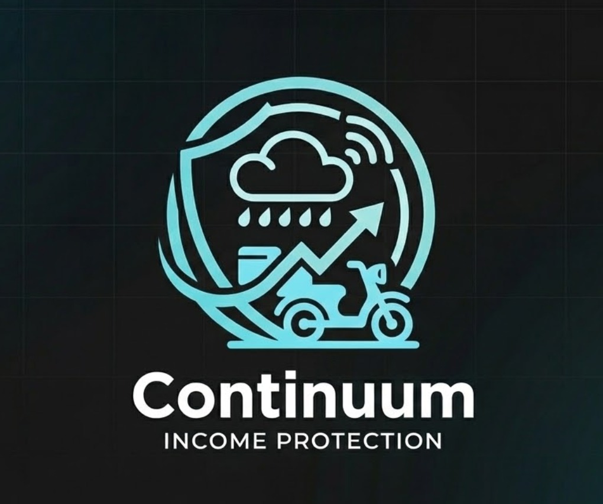
  <br />

  [](#)
  [](#)
  [](#)
  [](#)
  [](#)
  [](#)
  [](#)
  [](#)
  [](#)
  [](#)
  [](#)
  [](#)

  <br />

  **[Demo Video](https://www.youtube.com/watch?v=IHMCi3f6iaw)** &nbsp;| &nbsp;**[Pitch Deck](https://gamma.app/docs/Continuum-tj9d086rbvfjy58)**

  > **Round 2 Update:** This submission addresses reviewer feedback on insurance domain completeness. Standard coverage exclusions (war, terrorism, pandemic, CBRN) are now formally documented with actuarial rationale. The financial model has been upgraded from a conceptual heuristic to a full actuarial adequacy framework with quantitative inputs, governance triggers, and stress scenarios.

  > **IRDAI Compliance Audit:** An 11-point compliance audit was conducted against IRDAI parametric insurance guidelines. Key enhancements: AQI/CPCB oracle, event-type-weighted consensus, UPI eNACH mandate collection, forecast-driven enrollment lockout, double-entry financial ledger, PostGIS adjacency grace, proxy-zone bootstrap for data-sparse zones, payout SLA metrics, Aadhaar/device uniqueness constraints, model provenance verification, DPDP Act consent and 30-day proximity log retention, and Prometheus alerting for oracle health, SLA, and reserve levels.

  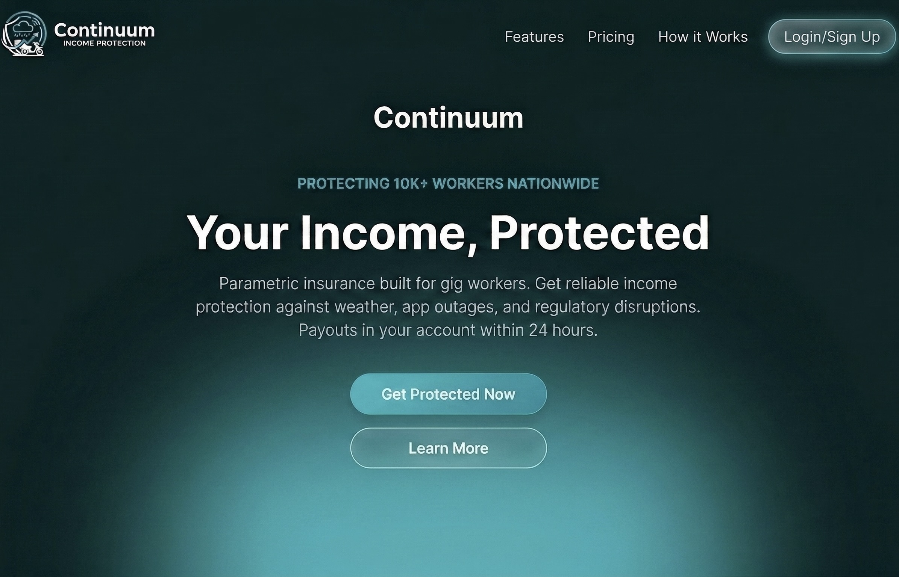
</div>

---

## The Problem

> One storm. One app outage. One week of lost income.

For gig delivery partners on Zomato and Swiggy, income is fragile. There are no sick days, no employer safety nets, and no recourse when the platform goes down at peak hours or rain makes roads unnavigable. A single disruption can wipe out a week's earnings — and filing a traditional insurance claim takes days, not minutes.

## The Solution

**Continuum** protects gig delivery partners from losing income during events they can't control — app outages, severe weather, municipal lockdowns. It detects the disruption automatically, validates it in real time, and pays out directly to the partner's UPI wallet — before they even file a complaint.

Continuum is strictly scoped to **loss of income protection** only. It is not vehicle insurance, medical cover, or life insurance. By replacing subjective claims processing with rule-based, parametric triggers, payouts are executed autonomously the moment a verified disruption occurs — with a weekly micro-premium aligned to the partner's own weekly payout cycle.

## Coverage Scope and Standard Exclusions

Continuum is a **parametric income protection product**, not a general insurance policy. Coverage is strictly bounded. The following is the formal product scope, including standard exclusions aligned with IRDAI-compliant insurance product design conventions.

### Covered Trigger Categories

* Severe weather disruptions that meet parametric thresholds (rainfall, wind, flooding, cyclone).
* Severe air quality events (AQI > 300 from CPCB CAAQMS stations) that make outdoor delivery unsafe.
* Verified platform outage disruptions that meet technical outage thresholds.
* Government-mandated curfews/lockdowns where machine-parseable advisories exist.

### Standard Exclusions (Explicit)

Continuum does **not** cover losses caused directly or indirectly by:

* **War, invasion, armed conflict, civil war, insurrection, or military action** — unbounded correlated loss, uninsurable under parametric micro-premium structure.
* **Terrorism, sabotage, or politically motivated violent acts** — intentional extreme loss volatility and accumulation risk.
* **Pandemics, epidemics, or declared public-health emergencies** — long-tail, multi-zone, prolonged business interruption risk that exceeds parametric product risk appetite (unless a specific approved rider is in force).
* **Nuclear, radiological, biological, or chemical (CBRN) contamination or events** — severity tail exceeds any parametric product's capital structure.
* **Platform employment termination, restructuring, or mass layoffs** — employment risk, not short-duration involuntary disruption risk.
* **Voluntary shutdowns, non-mandatory closures, or events below parametric trigger thresholds** — no objectively verifiable involuntary trigger event exists.

These exclusions mirror standard market practice (e.g., Lloyd's of London war exclusion clauses, Swiss Re pandemic exclusion frameworks) and are encoded in `terms_and_conditions.md` under `## 9) Exclusions`.

### Exclusion Rationale Matrix

| Exclusion Class | Why It Is Excluded | Risk Type |
|---|---|---|
| War / Armed conflict | Unbounded correlated loss not priced in weekly micro-premiums | Catastrophic correlated |
| Terrorism / Sabotage | Intentional extreme loss volatility and accumulation risk | Catastrophic correlated |
| Pandemic / Epidemic | Long-tail, multi-zone, prolonged business interruption risk | Systemic correlated |
| Nuclear / CBRN | Severity tail exceeds parametric product risk appetite | Extreme tail |
| Platform layoffs / restructuring | Employment risk, not short-duration disruption risk | Non-insurable under product scope |
| Voluntary shutdowns | No objectively verifiable involuntary trigger event | Behavioral / moral hazard |

## How Continuum Works

The engine behind this promise is fully deterministic — no adjuster, no form, no phone call.

Continuum relies on highly deterministic data oracles to eradicate the claims investigation phase entirely.

### Primary Data Oracles

* **Meteorological:** API integrations with the India Meteorological Department (IMD) and hyper-local weather nodes to track rainfall volume, wind speed, and extreme temperature anomalies.
* **Air Quality:** CPCB CAAQMS API integration for AQI-based triggers (threshold AQI > 300), enabling income-loss coverage during severe pollution events that make outdoor delivery unsafe.
* **Technological:** Programmatic scraping of Downdetector and synthetic ping monitoring of Zomato/Swiggy delivery/order-routing APIs to detect systematic outages.
* **Regulatory:** Automated parsing of municipal advisory RSS feeds governing lockdown measures or localized curfews.
* **Forecast (Adverse Selection):** IMD 72-hour-ahead forecast oracle that triggers zone-level enrollment freezes when high-risk events are predicted, preventing opportunistic sign-ups before known storms.

Oracle consensus is event-type-aware: weather triggers use IMD + AccuWeather + NASA GPM + ground sensors (3-of-4 required), while AQI triggers use CPCB + ground sensors + IMD (2-of-3 required). This avoids requiring rainfall oracles to vote on pollution events.

When oracle consensus converges above threshold, the payout is queued — autonomously.

At a glance, here is how the stack connects end to end:

<div align="center">
  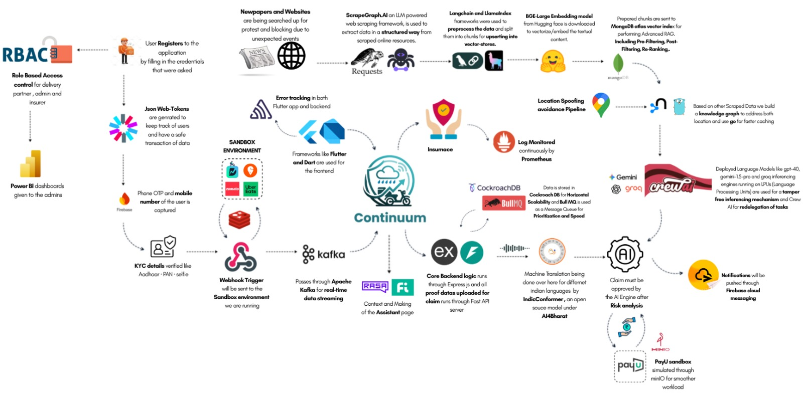
</div>

## Who We Built This For

This isn't a theoretical product. The triggers above were designed around real income patterns from real partners.

**Persona:** The Food Delivery Partner (Swiggy / Zomato Fleet)

Our core personas are grounded in **primary field research** — structured interviews conducted with **3 active Swiggy delivery partners** — revealing massive income volatility and outsized exposure to structural platform penalties. Raw interview recordings are available for review: <div align="center">**[🎙️ User Interview Recordings (Google Drive)](https://drive.google.com/drive/folders/1pVeuibqcbkzK8ll4A9IWnUjMeMUlhQXv)**.

  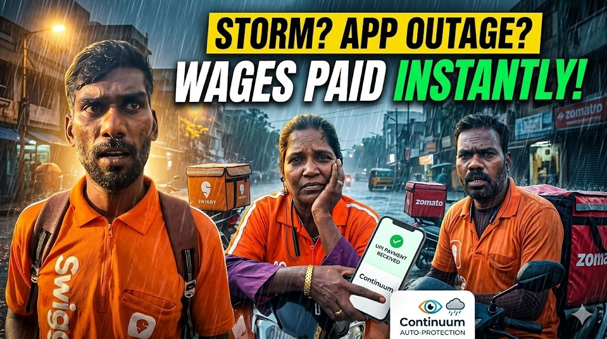
</div>

* **The Power User (Sudarshan):** Works exhaustive 17-hour shifts (e.g., 45-50 orders/day) generating ~₹3,000 gross (₹2,100 net after fuel and food). Highly exposed to the platform's strict **₹250 penalty** for failed deliveries, disproportionately punitive given their operational volume.
* **The Full-Time Earner (Dakshina Moorthy):** Operates on grueling 15-hour schedules (8 AM - 11 PM), moving ~30 orders/day. They noted that platform penalties frequently equal or exceed the total earnings of a single order, highlighting a fragile risk-to-reward ratio.
* **The Part-Time Operator (Sudha):** Works focused 8-hour blocks for ~20 orders/day, earning ₹700-₹800. These participants specifically articulated a need for a deterministic safety net against generalized operational shutdowns, such as localized municipality strikes or severe urban waterlogging (floods).

* **Economic Profile:** Relies entirely on daily active hours for income. Highly sensitive to downtime. Operates on weekly aggregate payouts.
* **Operational Geography:** Hyper-local, constrained to specific municipal zones.
* **Risk Exposure:** 100% exposed to environmental, technological, and regulatory disruptions without traditional employment benefits, compounded by outsized punitive frameworks for unfulfilled orders.

### Scenario 1: Hyper-Local Application Outage

* **Disruption:** The regional Swiggy merchant order assignment API experiences a catastrophic 3-hour downtime during the peak Friday dinner rush.
* **Continuum Response:** Continuum’s oracle networks detect the downtime via Downdetector scraping and localized API latency checks. The anomaly is verified, and the parametric threshold is breached. Partner accounts active in the affected geolocation automatically receive a proportional wage-loss payout directly to their registered UPI wallets before the app is restored.

### Scenario 2: Severe Meteorological Event

* **Disruption:** A sudden, unforecasted torrential downpour and localized waterlogging in the partner's active delivery zone trigger a municipal "Red Alert," making physical delivery impossible.
* **Continuum Response:** The IMD Weather API oracle registers rainfall exceeding 50mm within a 2-hour window in the specific geographical polygon. The contract executes automatically, compensating the partner for the anticipated lost hours, allowing them to seek shelter safely without financial penalty.

## The Economics

Traditional insurance utilizes annual or monthly premiums, fundamentally misaligning with gig worker cash flows. Continuum enforces a strictly **Weekly Premium Cycle** anchored to actuarial adequacy first, affordability second.

* **"The One-Order Rule" (UX Affordability Constraint):** The weekly premium targets the behavioral cost of 1–2 successful deliveries. This is a UX ceiling, not a pricing floor — the technical premium always wins if it exceeds the affordability anchor.
* **Cash Flow Alignment:** Premiums are collected automatically via UPI eNACH mandates on a timeline identical to the Zomato/Swiggy weekly payout cadence, abstracting the cognitive load of large upfront payments. The mandate lifecycle (CREATED / APPROVED / ACTIVE / REVOKED / FAILED) is tracked in a dedicated `mandates` table with webhook-driven state transitions.
* **Dynamic Risk Rating:** The premium is recalculated every week using predictive modeling on a 16-dimensional feature vector. Premiums adjust based on the 7-day meteorological forecast, AQI trends, zone-level loss ratio history, and partner activity profile. Data-sparse zones (< 90 days of history) use proxy-zone KNN bootstrap with a 1.25x uncertainty multiplier on the risk margin.
* **Micro-Transactions:** Payments are structured as high-frequency, low-denomination micro-premiums, reducing the barrier to entry to near zero. Weekly debits are spread across a 1-hour BullMQ scheduling window to prevent thundering-herd effects.

### Quantitative Actuarial Framework

The One-Order Rule is a **UX affordability constraint**, not a pricing rule. Pricing is governed by an actuarial adequacy floor derived from expected loss modeling. The framework below defines the technical premium calculation that the affordability anchor is bounded by.

> The affordability anchor is a ceiling objective. If the technical premium exceeds it, the technical premium is charged. Solvency is never subordinated to UX.

For zone `z`, tier `t`, week `w`:

```text
ExpectedLoss(z,t,w) = sum_over_events_e [ P(e|z,w) * Severity(e,z,t,w) * Exposure(t,w) ]

TechnicalPremium(z,t,w) = ExpectedLoss + ExpenseLoad + FraudLoad + ReinsuranceLoad + RiskMargin

FinalPremium(z,t,w) = max(AffordabilityAnchor(z,t,w), TechnicalPremium(z,t,w))
```

### Pricing Inputs and Update Cadence

| Input | Symbol | Source | Update Cadence |
|---|---|---|---|
| Event probability by trigger type | `P(e/z,w)` | Historical oracle events + forecast priors | Weekly |
| Event severity / expected payout weight | `Severity(e,z,t,w)` | Tier limits + disruption intensity mapping | Weekly |
| Exposure (active policy and activity profile) | `Exposure(t,w)` | Active partner-days and hourly activity curves | Daily/Weekly |
| Fraud adjustment load | `FraudLoad` | Claims anomaly rates and confirmed fraud recovery | Weekly |
| Expense load | `ExpenseLoad` | Payment, infra, support, and ops cost allocation | Monthly |
| Reinsurance load | `ReinsuranceLoad` | Treaty pricing and catastrophe attachment terms | Monthly/Quarterly |
| Risk margin | `RiskMargin` | Solvency target and volatility buffer | Weekly |

### Actuarial Adequacy and Governance Constraints

* **Affordability is a ceiling objective, not a solvency override:** if affordability anchor is below technical premium, technical premium wins.
* **Zone repricing trigger:** sustained 4-week zone loss ratio above 80% triggers mandatory premium recalibration.
* **Escalation trigger:** sustained 13-week loss ratio above 100% triggers exposure controls and underwriting review.
* **Catastrophe trigger:** events with more than 1,000 simultaneous impacted policies activate reinsurance pathways.
* **Reserve floor:** minimum 90-day payout runway held in low-risk liquid instruments.

### Actuarial Validation Gates (for Production Readiness)

* **Backtesting depth:** Minimum 24 months event history per mature zone, with rolling out-of-sample validation.
* **Data-sparse zones:** Proxy-zone bootstrap plus uncertainty multiplier until sufficient local history is collected.
* **Calibration quality:** Probability calibration checks on trigger frequencies and payout incidence, not only point prediction error.
* **Loss ratio governance:** Zone-level and portfolio-level loss ratio monitored weekly with documented intervention thresholds.
* **Capital protection:** Mandatory reserve coverage and correlated-event reinsurance activation thresholds.
* **Concentration controls:** Exposure caps per trigger type and per zone to prevent single-event liquidity shocks.

### Stress and Solvency Scenarios

The model is validated against at least three quantitative stress classes:

* **Catastrophic correlated event:** Large simultaneous policyholder impact (cyclone/flood cluster).
* **Systemic technology outage:** Platform-wide service disruption exposure.
* **Climate drift scenario:** Multi-season increase in severe-event frequency versus training baseline.

Passing these scenarios is required before deployment-grade pricing sign-off.

### Illustrative Weekly Premium Walkthrough (Conceptual)

Example for one zone-tier cell — Silver tier, Bangalore South zone, moderate-risk week (illustrative only; production values require licensed actuarial calibration against ≥24 months of historical event data):

```text
P(weather_event | zone, week) = 0.12   (12% weekly trigger probability, from IMD historical data)
AvgSeverity                   = ₹320   (weighted avg payout across disruption intensities)
Exposure                      = 1.0    (full active week)

ExpectedLoss = 0.12 × 320 × 1.0 = ₹38

ExpenseLoad  = ₹9   (payment rails, infra, support — ~24% of expected loss)
FraudLoad    = ₹4   (anomaly rate × recovery cost)
Reinsurance  = ₹5   (treaty cost allocation per policy)
RiskMargin   = ₹6   (solvency buffer targeting 150% coverage ratio)

TechnicalPremium = 38 + 9 + 4 + 5 + 6 = ₹62
AffordabilityAnchor (One-Order Rule) = ₹55

FinalPremium = max(55, 62) = ₹62
```

This keeps pricing behaviorally affordable where possible, but never below actuarial adequacy.

### Actuarial Lab (`services/actuarial_lab/`)

A dedicated Python service implements the quantitative validation gates described above:

* **`historical_backtest.py`** — Queries TimescaleDB and CockroachDB to compute zone-level and portfolio-level loss ratios, expected vs. realized trigger counts, Brier score, calibration buckets, and rolling 13-week loss ratios.
* **`stress_scenarios.py`** — Simulates three stress classes (catastrophic correlated event, systemic technology outage, climate drift) against current premium and reserve levels. Outputs simulated payouts, BCR under stress, and reserve depletion days.
* **`ci_gate.py`** — CI/CD gate script that fails the pipeline if rolling 13-week portfolio loss ratio exceeds 100% or any stress scenario results in reserve depletion below 90 days.

### Current Validation Status

* **Prototype status:** Framework and controls are implemented for hackathon scope with runnable backtest and stress-test pipelines.
* **Before production:** Final rates and exclusions require licensed actuarial review and legal/regulatory sign-off.
* **Why this matters:** It prevents underpriced coverage while preserving partner affordability.

Three tiers map directly to a partner's weekly order volume:

<div align="center">
  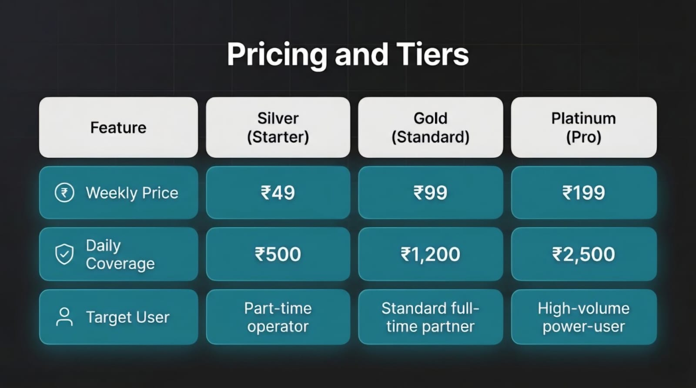

  **Disclaimer:** The Prices shown are only base prices. Actual prices will be updated in realtime according to the pricing model.
</div>

## The App Experience

The partner never sees any of the oracle complexity. They see this.

<div align="center">
  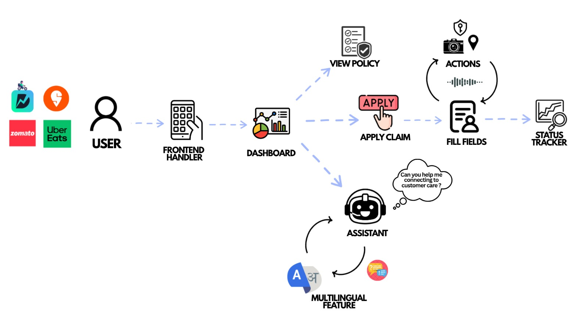
</div>

<br />

<div align="center">

| | | |
|:---:|:---:|:---:|
| 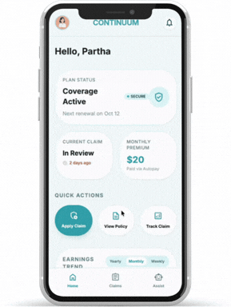 | 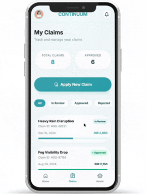 | 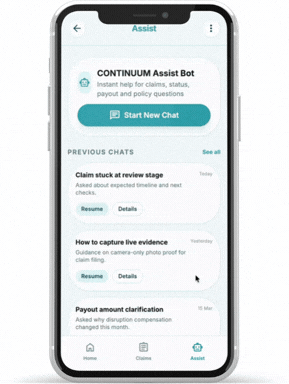 |
| | | |
| 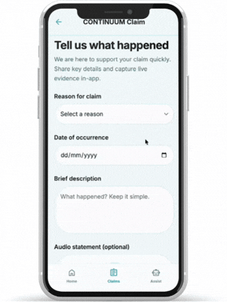 | 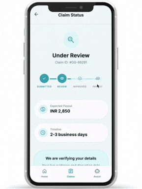 | 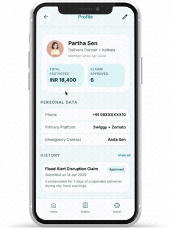 |

</div>

### Built for the Field

* **Mobile-first for real field constraints:** Food delivery partners run the job from their phones. Flutter keeps the UI responsive on budget devices (₹8k–₹15k).
* **Safety-critical notifications in real time:** When a verified disruption triggers a payout, partners get instant lock-screen alerts via Firebase Cloud Messaging.
* **Shipped fast across Android and iOS:** A single Flutter codebase and hot reload let us prototype and deploy within the hackathon timeline—without doubling engineering cycles.
* **Offline resilience for unreliable connectivity:** Offline-first persistence (Hive/SQFlite) keeps premium deductions and submissions reliable, syncing safely when the network returns.

## Intelligence Layer

Behind the interface, two ML pipelines run autonomously on every premium cycle and every claim.

Continuum moves beyond static actuarial tables, deploying ML models for active risk assessment and fraud prevention.

**Risk Profile Engine** — Gradient Boosting model consuming a 16-dimensional feature vector from TimescaleDB historical weather, AQI event history, live Weather API data, and worker activity to dynamically price each partner's weekly premium. Data-sparse zones fall back to proxy-zone KNN medians with a 1.25x risk margin uncertainty multiplier:

<div align="center">
  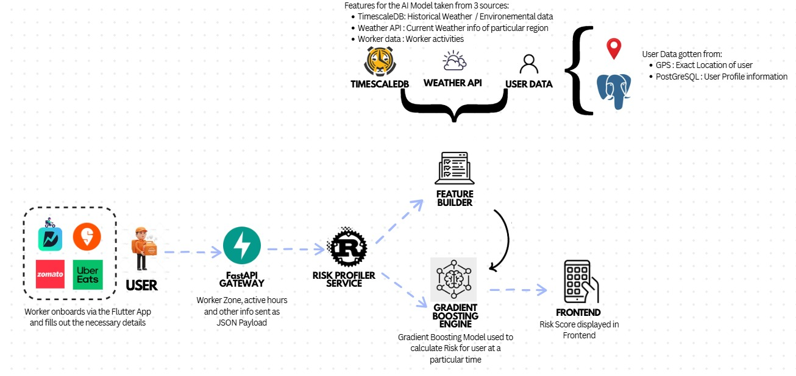
</div>

<br />

**Claims Scoring Pipeline** — Isolation Forest anomaly detection (with SHA-256 model provenance verification against `model_card.json` at startup) that auto-approves clean claims (score >= 0.7), routes suspicious ones to the fraud queue, and supports adjacency grace (50% pro-rated payout for claims in ST_Touches-adjacent zones):

<div align="center">
  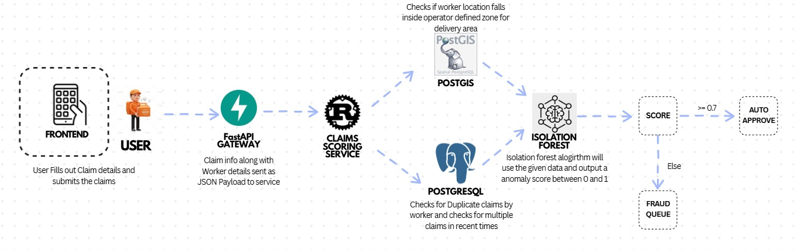
</div>

## System Architecture

The full stack is purpose-built for financial-grade reliability at gig-worker scale. The diagram above shows the end-to-end topology; the table below breaks it down layer by layer.

Every layer was chosen to serve a specific reliability, performance, or compliance constraint:

| Layer | Technology | Role |
|---|---|---|
| **Frontend** | Flutter, Dart | Cross-platform mobile app (Android primary, iOS secondary) |
| **Auth & Identity** | RBAC, JWT, Firebase (Phone OTP), Aadhaar/PAN KYC | Role-based access for partner / admin / insurer; biometric & KYC verification |
| **Core Backend** | Express.js (Node.js) | REST API server — primary business logic, policy and user services |
| **Claims API** | FastAPI (Python) | Handles proof data upload and claim processing pipeline |
| **Message Queue** | Apache Kafka | Real-time data streaming for webhook triggers and oracle events |
| **Task Queue** | Bull MQ | Prioritized background job processing (payout retries, notification dispatch) |
| **Database** | CockroachDB | Distributed SQL — horizontally scalable, ACID-compliant double-entry financial ledger |
| **Vector Store** | MongoDB Atlas (Vector Index) | Advanced RAG with Pre-Filtering, Fast-Filtering, and Re-Ranking |
| **Embeddings** | BGE-Large (HuggingFace) | Text vectorization for RAG knowledge base |
| **RAG Orchestration** | LangChain + LlamaIndex | Data preprocessing, chunking, and vector upsert pipeline |
| **Web Intelligence** | ScrapeGraph.AI | LLM-powered structured scraping of news and municipal advisory sources |
| **Knowledge Graph** | Go (caching layer) | Location-aware knowledge graph built from scraped disruption data |
| **AI / LLM Engine** | Gemini (gemini-1.5-pro), Groq, GPT-4o | Inference engine for fraud scoring, risk analysis, claim validation |
| **Agent Orchestration** | Crew AI | Multi-agent task delegation for autonomous claim pipeline steps |
| **Conversational AI** | RASA + Fi | In-app assistant — context-aware partner support bot |
| **Multilingual NLP** | IndicConformer (AI4Bharat) | Machine translation for regional Indian languages |
| **Payments (Payout)** | PayU Sandbox (via minIO) | Simulated UPI payout disbursement with smoother workload distribution |
| **Payments (Collection)** | PayU eNACH / UPI Autopay | Frictionless weekly premium collection via recurring mandates with webhook-driven state management |
| **Actuarial Lab** | Python (TimescaleDB + CockroachDB) | Historical backtesting, stress scenarios, BCR calculation, and CI/CD gate enforcement |
| **Push Notifications** | Firebase Cloud Messaging | Real-time lock-screen alerts on payout and disruption events |
| **Monitoring** | Prometheus + Alertmanager | Continuous monitoring with alerts for oracle abstention (>40%), payout SLA breach (>2h), and low reserves (<Rs. 100K) |
| **Admin Dashboard** | Power BI | Business intelligence dashboards for admins and insurers |
| **Environment** | Sandbox (Flutter/Dart) | Isolated development environment for safe end-to-end simulation |

## Trust Architecture

A system that pays automatically without human review is a system that adversaries will probe. Here is how Continuum is hardened.

> **Threat Model:** A coordinated fraud ring of 500 delivery partners uses consumer-grade GPS spoofing applications to simultaneously position themselves inside a flood-triggered payout zone. Simple GPS verification is insufficient. This section documents a layered, deterministic defense architecture hardened against this specific attack vector and 99 analogous failure modes.

<div align="center">
  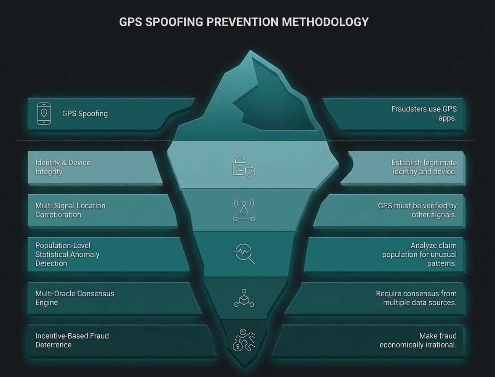
</div>

### The Core Insight: GPS is Necessary, Not Sufficient

A single GPS coordinate is a claim, not proof. Every payout gate in Continuum requires **corroborating evidence from independent signal layers**. A fraudster who can fake one layer almost never controls all of them simultaneously.

### Layer 1 — Identity & Device Integrity

The first perimeter. A fraudster who cannot establish a legitimate identity cannot participate.

* **1:1 Device Binding:** Each Policy ID is cryptographically bound to a unique device fingerprint (Device_ID). A second policy registration on the same device is rejected at the database constraint level; no application-layer logic can override this. Enforced by a `UNIQUE` partial index on `device_fingerprint WHERE device_fingerprint IS NOT NULL` in the `workers` table.
* **National KYC Linkage:** Aadhaar/PAN verification enforces a 1:1 mapping between national identity and active policy count. Family-member account farming is structurally impossible within this constraint. Enforced by a `UNIQUE` partial index on `aadhaar_hash WHERE aadhaar_hash IS NOT NULL`, ensuring database-level deduplication.
* **Play Integrity API / SafetyNet Attestation:** Android emulators and rooted devices lack valid hardware attestation certificates. Claims from non-attested devices are automatically ineligible. The platform periodically re-attests devices on the background to catch post-enrollment compromise.
* **Biometric Liveness on Claim Submission:** A biometric face-scan challenge is injected at claim submission, defeating both account-lending schemes and static-ID theft. The liveness detection module specifically flags deepfake-generated video via a dedicated third-party API (e.g., iProov), cross-referencing blink patterns and micro-lighting artifacts that generative models fail to replicate consistently.

### Layer 2 — Multi-Signal Location Corroboration

GPS coordinates must be corroborated by at least two independent signals before location is considered verified.

* **Cellular Network Triangulation (Cell-ID):** If the GPS coordinate and the Cell-ID triangulation mismatch by more than 2km, the location claim is flagged. A spoofing app can inject a false GPS position into the OS; it cannot simultaneously spoof the carrier-reported Cell-ID from the cellular basestation.
* **The Soak Period Requirement:** A partner must have been GPS-verified inside the target polygon for a minimum of **45 continuous minutes before** the parametric trigger fires. Pre-trigger positioning (driving into the zone seconds before a known alert) is thus structurally unrewarded.
* **Temporal Ping Consistency:** Location is sampled across a minimum of 3 independent timestamps within the disruption window. A single fraudulent ping is insufficient. Coordinate velocity = 0 for extended periods (static lock at a fixed address) triggers an automatic eligibility suspension.
* **Delivery Platform Cross-Reference:** If the Swiggy/Zomato API reports that a partner *completed* one or more orders during the stated disruption window, the payout claim is vetoed. A partner cannot be both "unable to work due to disruption" and simultaneously transacting on the platform. This cross-reference is a hard, unappealable veto.

### Layer 3 — Population-Level Statistical Anomaly Detection

The most powerful anti-fraud signal is not found by examining individual claims — it is found by examining the **population of claims simultaneously**.

* **Geographic Convergence Alert:** If ≥50 unique policy IDs file claims pointing to an identical or near-identical lat/long polygon within a 5-minute window, the zone triggers an automatic **"Convergence Freeze"**. All pending claims for that zone are queued for a mandatory 24-hour review hold before any payout is released. A genuine flood will affect the zone gradually; 500 fraudsters converging instantaneously is a statistical signature unique to coordinated rings.
* **Social Graph Clustering:** Device-level Bluetooth and WiFi proximity logs are analyzed at the time of claim. Claims from a cluster of devices that have been in close physical proximity over the prior 7 days (indicative of a coordinated group) are flagged for elevated review. Genuine partners stranded in a flood zone may be near each other, but they did not spend the prior week in the same room. Proximity data collection requires explicit DPDP Act 2023 consent (`proximity_consent` flag), and all proximity logs are auto-purged after 30 days via a `pg_cron` scheduled job (with application-level fallback).
* **Velocity Limiting:** A maximum of **3 successful claims per policyholder per 90-day rolling window** is enforced. Chronic super-claimants who exceed this threshold are moved to a mandatory manual review hold, regardless of the technical validity of individual claims.

### Layer 4 — Multi-Oracle Consensus Engine

No single data source can unilaterally authorize a payout. Trigger events require **event-type-weighted oracle consensus**.

* **Oracle Vote Architecture:** Oracle sets are selected per event type. Weather triggers poll 4 independent data oracles: (1) IMD Primary API, (2) Private Weather Network (e.g., AccuWeather commercial feed), (3) Satellite Precipitation Data (NASA GPM API), (4) Ground-level sensor aggregation — requiring 3-of-4 affirmative votes. AQI triggers poll CPCB CAAQMS, ground sensors, and IMD — requiring 2-of-3. Technology outages use Downdetector, synthetic ping, and platform API — requiring 2-of-3. This prevents irrelevant oracles from voting on events outside their competency.
* **Stale Data Handling:** Oracle data carries a maximum TTL of 15 minutes. Data exceeding this TTL is treated as an **oracle abstention**, not a vote. An abstaining oracle does not vote "yes." Prometheus alerts fire when the abstention rate exceeds 40%.
* **Certificate Pinning with Dual-Pin Rotation:** All HTTPS calls to external data APIs are protected by certificate pinning with dual-pin rotation slots. Two fingerprints are maintained per oracle, enabling seamless certificate rotation without service disruption. An unexpected certificate causes the oracle's vote to be automatically nullified for that polling cycle.
* **Randomized Poll Scheduling:** Oracle polling intervals are randomized within a ±8 minute window around the base cron schedule. This schedule is never exposed externally, making it computationally infeasible to time fraudulent activity to the exact millisecond between sensor checks.
* **Forecast-Driven Enrollment Lockout:** A separate forecast oracle polls IMD 72-hour predictions and publishes `enrollment_lock` events via Kafka when high-risk conditions are predicted. The `POST /policies` endpoint checks `zone_enrollment_locks` and returns HTTP 423, preventing opportunistic enrollment before known events.

### Layer 5 — Incentive-Based Fraud Deterrence

Structural policy design that makes fraud economically irrational.

* **72-Hour Activation Delay:** New policy enrollments have a 72-hour waiting period before claim eligibility activates. Same-day enrollment and same-day claims are architecturally impossible.
* **5-Day Tier-Upgrade Waiting Period:** Tier upgrades (e.g., Silver → Platinum) do not take effect for claim purposes until 5 days after the upgrade is processed. Pre-event opportunistic coverage escalation yields zero payout advantage.
* **Cancellation Cycle Lock:** Policy cancellations are not effective until the current 7-day billing cycle completes. A partner cannot cancel mid-week after a disruption event is publicly announced.
* **Referral Reward Delay:** Referral bonuses are withheld until the referred partner completes 60 days with zero claims. This destroys the economics of referral-farming fraud rings.

### How We Distinguish a Genuine Stranded Worker from a Fraudster

| Signal | Genuine Partner | Fraud Ring Member |
| ------ | --------------- | ----------------- |
| Device Attestation | Valid hardware cert | Emulator / rooted device |
| GPS + Cell-ID Match | < 500m divergence | Often > 2km divergence |
| Soak Period Compliant | In zone ≥ 45 min pre-trigger | Arrived post-trigger announcement |
| Platform Order History | Zero orders during disruption | May show completed orders |
| Claim Population Density | Distributed across zone | Statistically converged on identical polygon |
| Claim Velocity | ≤ 1 claim per event | Multiple claims in short window |
| Device Proximity History | No prior group clustering | Devices co-located in prior 7 days |

> No single signal is decisive. The genuine partner passes every layer. The fraud ring member cannot simultaneously clear all seven.

---

Anti-fraud is one half of system trust. The other half is deterministic behavior at the boundary conditions where parametric systems typically fail.

### Payout Edge Cases & Fallback Logic

A parametric system is only as trustworthy as its edge-case handling. Three categories of boundary conditions are handled deterministically:

<div align="center">
  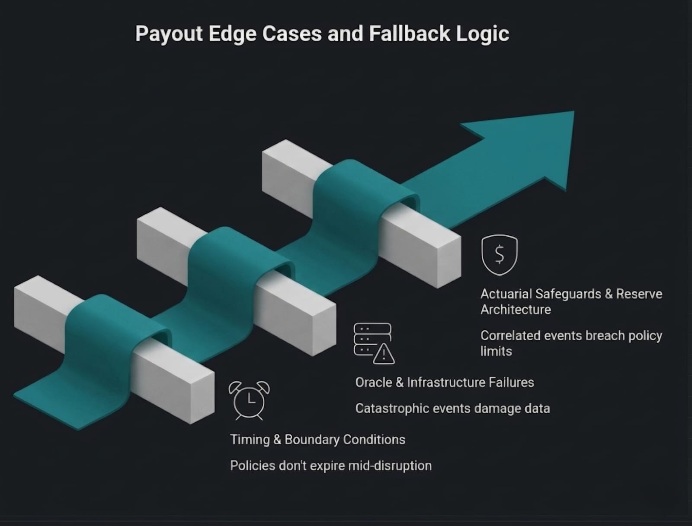
</div>

<br />

### Timing & Boundary Conditions

* **Trigger fires at 11:59 PM on last day of policy week:** If a parametric trigger fires while the policy is technically active—even by 1 minute—the full week's coverage benefit is honored. Policies do not expire mid-disruption.
* **Partner in adjacent, non-triggered zone is also stranded:** Partners in zones immediately bordering a triggered polygon receive a **50% pro-rated payout** (the "Adjacency Grace" rule), implemented via PostGIS `ST_Touches` adjacency lookup. The claims scoring service returns an `adjacency_grace: true` flag and the `adjacent_zone_id`, and the payout record is flagged with `adjacency_pro_rated = TRUE` for audit.
* **Partner's GPS centroid spans two municipal boundaries:** Payout is calculated against the municipality containing the GPS centroid, not the zone with the higher coverage value. Partial-zone events pay 50% if the centroid falls within the affected region.
* **Two qualifying disruptions occur within the same 7-day policy cycle:** A hard cap of **one successful payout per 7-day policy cycle** applies, regardless of the number of distinct parametric triggers that fire. This constraint is foundational to actuarial solvency.

### Oracle & Infrastructure Failures

* **≥2 of 4 oracles are offline simultaneously during a verified disaster:** When a catastrophic event physically damages data infrastructure, the system applies a **"Benefit of Doubt" protocol**: a capped 50% payout is automatically authorized for all active policies in the affected zone if at least 1 oracle confirms the event and 2+ are confirmed offline. Waiting for full oracle consensus during a disaster is a design failure.
* **UPI/NPCI payment rails go down nationally:** All valid payouts are queued in an immutable ledger and auto-retried with exponential backoff. A Razorpay-held wallet escrow serves as an interim reserve for partners who require immediate liquidity.
* **Partner's UPI number is compromised via SIM swap:** All payout disbursements are subject to a **6-hour SIM-change cooling period**. Any account with a recent SIM change requires biometric re-confirmation before funds are released.

### Actuarial Safeguards & Reserve Architecture

* **Double-Entry Financial Ledger:** Reserve management uses a full double-entry ledger (`ledger_accounts` + `ledger_entries` tables in CockroachDB) instead of a single-row balance counter. All debits use `SELECT ... FOR UPDATE` serialized transactions with explicit balance checks, eliminating the overdraw race condition inherent in single-row designs. Core accounts: RESERVE_MAIN, PREMIUM_INCOME, PAYOUT_EXPENSE, REINSURANCE_FUND.
* **Correlated catastrophic event (cyclone, earthquake) affects >1,000 simultaneous policies:** A mandatory reinsurance treaty is activated for any single event breaching the 1,000-simultaneous-policyholder threshold. This is the capital backstop that prevents catastrophic liquidity events from invalidating all outstanding policies.
* **Zone-specific loss ratio exceeds 80% for 4 consecutive weeks:** The dynamic pricing engine triggers an automatic premium escalation for that specific zone. Partners in the zone are notified 7 days in advance of premium changes. This is the real-time actuarial feedback loop.
* **Minimum 90-day reserve requirement:** IRDAI-mandated solvency margins require Continuum to hold a minimum 90-day payout reserve in escrow at all times, held exclusively in RBI-approved low-risk liquid instruments (e.g., Treasury bills, money market funds). Zero equity exposure is permitted on reserve capital.
* **Payout SLA Enforcement:** End-to-end payout latency (oracle trigger to UPI disbursement) is tracked by a `payout_latency_seconds` Prometheus histogram. Payouts exceeding the 2-hour SLA increment a `payout_sla_breach_total` counter and fire a `PayoutSLABreach` alert. A `ReserveLow` alert fires when the reserve balance drops below Rs. 100,000.

## Terms and Conditions

The adversarial-risk model has been converted into a formal policy draft here:

* `terms_and_conditions.md`

This draft translates the 100 adversarial failure scenarios into enforceable eligibility, exclusion, anti-fraud, payout, data, and dispute clauses for Continuum's income protection product.

It includes:

* Standard insurance exclusions (war, terrorism, pandemic, nuclear/CBRN categories).
* Parametric trigger boundaries and non-covered event classes.
* Financial safeguards tied to reserves, repricing, and reinsurance controls.

For convenience, see exclusion clauses in `terms_and_conditions.md` under `## 9) Exclusions`.

---

## 🚀 Live Azure Deployment

The Continuum microservice architecture is fully containerized and currently hosted on an Azure B-Series Virtual Machine at **IP `4.186.27.77`**.

A total of 11 core microservices (+3 infrastructure containers) are actively running and communicating via Docker Compose.

### Port Mappings & Services

| Service | Technology | Port Map | IP Link |
|---|---|---|---|
| **FastAPI Gateway** | Python / FastAPI | `8000` | [http://4.186.27.77:8000/docs](http://4.186.27.77:8000/docs) |
| **RAG Orchestrator** | Python / LlamaIndex| `8001` | http://4.186.27.77:8001 |
| **Rasa / Gemini Assistant**| Python / Gemini API| `8002` | http://4.186.27.77:8002 |
| **Web Intelligence** | Python / ScrapeGraph| `8003` | http://4.186.27.77:8003 |
| **KG Cache** | Go | `8004 -> 8080`| http://4.186.27.77:8004 |
| **Core Backend** | Express.js | `3000` | http://4.186.27.77:3000 |
| **Claims Scoring** | Rust | `8080` | (Internal API) |
| **Isolation Forest** | Python | Unix Socket | (Sidecar communication) |
| **Crew AI Agent** | Python | Background | (Kafka Worker) |
| **Oracle Engine** | Python | Background | (Kafka Worker — event-type-weighted consensus + forecast lockout) |
| **Actuarial Lab** | Python | CLI / CI | (Backtest + stress test + CI gate) |
| **Risk Profiler** | Python / FastAPI | Background | (16-dim feature vector, proxy-zone bootstrap) |
| **PostgreSQL** | Postgres 15 | `5432` | (Infra Database) |
| **Redis** | Redis Alpine | `6379` | (Infra Cache) |
| **Kafka & Zookeeper** | Confluent | `9092 / 2181` | (Message Broker) |

---

## Getting Started

The following sets up the full Continuum stack locally. For a detailed contributor guide, see `CLAUDE.md`.

### Prerequisites

* [Flutter SDK](https://docs.flutter.dev/get-started/install) >= 3.8
* Node.js >= 20.x
* Python >= 3.11
* Docker & Docker Compose (recommended for full stack)
* Rust toolchain (for claims_scoring)
* Go >= 1.21 (for kg_cache)

### Option A: Full Stack via Docker Compose

```bash
git clone https://github.com/your-org/continuum.git
cd continuum
cp .env.example .env   # fill in POSTGRES_PASSWORD, JWT_SECRET, etc.
docker compose up --build
```

This starts all 11 services plus PostgreSQL, Redis, Kafka, and Zookeeper.

### Option B: Individual Service Startup

#### Core Backend (Node.js, port 3000)

```bash
cd services/core_backend
npm install
cp .env.example .env   # configure DB, JWT_SECRET, Kafka
npm run dev
```

#### Database Migrations (run PostgreSQL before CockroachDB)

```bash
# PostgreSQL
psql -h localhost -U postgres -d continuum
\i db/migrations/postgres/001_initial_schema.sql
# ... run all numbered migrations in order

# CockroachDB
cockroach sql --insecure --database=continuum
\i db/migrations/cockroachdb/001_initial_schema.sql
# ... run all numbered migrations in order
```

#### FastAPI Gateway (Python, port 8000)

```bash
cd services/fastapi_gateway
pip install -r requirements.txt
uvicorn main:app --reload
```

#### Claims Scoring (Rust, port 8080)

```bash
cd services/claims_scoring
cargo build && cargo run
```

#### Flutter Mobile App

```bash
flutter pub get
flutter run
```

---

<div align="center">
  <em>Continuum turns income protection from a privilege into a default — available to every delivery partner, activated before they even know they need it. Built for the Devtrails Guidewire Hackathon.</em>
</div>
